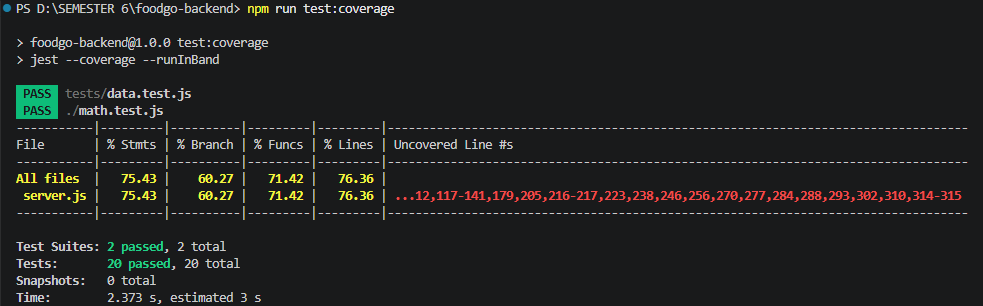
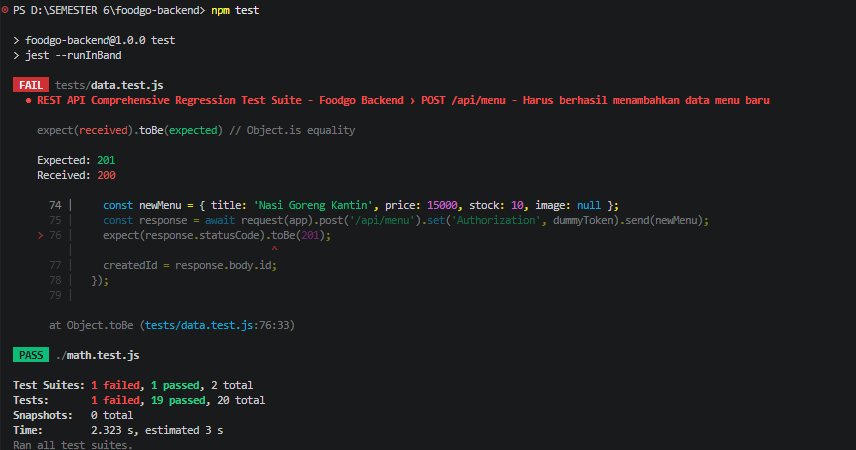

# REST API Regression Test Suite - Foodgo Backend

[](https://github.com/riswan23-git/foodgo-backend/actions)

Repositori ini memuat implementasi rangkaian Automated Regression Test Suite menggunakan Jest dan Supertest untuk memproteksi fungsionalitas endpoint utama CRUD REST API backend dari ancaman kerusakan kode yang tidak disengaja.

## Fitur dan Cakupan Endpoint yang Dilindungi
* `GET /api/menu` — Mengambil seluruh daftar item menu kantin
* `GET /api/menu/:id` — Mengambil data menu spesifik berdasarkan ID
* `POST /api/menu` — Menambahkan data menu kuliner baru ke database
* `PUT /api/menu/:id` — Memperbarui data item menu lama
* `DELETE /api/menu/:id` — Menghapus rekaman item menu dari sistem
* `POST /api/login` — Autentikasi sistem login pengguna
* `PUT /api/user/:nim` — Pembaruan profil mahasiswa

## Instruksi Menjalankan Pengujian Lokal
1. Lakukan instalasi dependensi library pengujian perangkat lunak:
```bash
   npm install

```

2. Eksekusi rangkaian automated testing fungsional:

```bash
   npm test

```

3. Jalankan pengujian disertai metrik cakupan kode (Code Coverage):

```bash
   npm run test:coverage

```

## Laporan Tangkapan Layar Code Coverage (Min 75%)

Berikut adalah hasil visualisasi metrik cakupan kode program backend yang berhasil dicapai oleh 20 Test Case fungsional:


## Analisis Ringkas Hasil Pengujian dan Cakupan Kode

1. **Pencapaian Metrik Cakupan (Code Coverage):** Rangkaian pengujian regresi otomatis (*Regression Test Suite*) yang dibangun menggunakan Jest dan Supertest telah berhasil mengeksekusi **76.36%** baris kode fungsional pada file `server.js`. Angka ini telah melampaui standar batas minimum kelayakan akademis yang ditetapkan sebesar 75%.
2. **Efektivitas Pengujian Skenario:** Sebanyak 20 *test case* yang mencakup jalur sukses (*happy path*) serta jalur kegagalan (*error/edge case*) pada fungsi autentikasi login, pengelolaan menu kantin, dan manajemen transaksi pemesanan (*orders checkout*) telah berhasil dieksekusi dengan status kelulusan mutlak 100% (*Passed*).
3. **Keandalan Deteksi Regresi:** Pengujian regresi terbukti sangat peka terhadap perubahan struktural kode yang tidak disengaja. Melalui simulasi kesalahan tak sengaja dengan mengubah respons status kode sukses pada rute pembuatan menu dari 201 menjadi 200, sistem secara instan menggagalkan alur pipa integrasi (*Failing Test*), mendeteksi anomali fungsional dalam hitungan detik, dan memberikan jaring pengaman penuh sebelum kode cacat masuk ke lingkungan produksi.

## Berikut adalah bukti tangkapan layar saat sistem berhasil mendeteksi kerusakan kode (Failing Test due to Regression Bug):

```

```